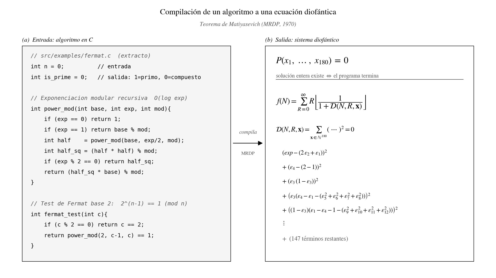

# Project Diophantus

[](https://opensource.org/licenses/MIT)
[](https://www.python.org/)
[](https://github.com/Javitax47/Proyecto-Diophantus)

> Compilador de algoritmos a geometría algebraica.

---

## Visión General

**Project Diophantus** es una herramienta de investigación experimental que conecta las ciencias de la computación con la teoría de números, ofreciendo una implementación constructiva del **Teorema de Matiyasevich (MRDP)**. Su motor es capaz de procesar algoritmos definidos en C y traducirlos en un único objeto matemático: un **Sistema de Ecuaciones Diofánticas**.

El resultado final no es un ejecutable binario, sino un polinomio $P(x_1, \dots, x_n) = 0$ que posee soluciones enteras si y solo si el algoritmo original finaliza con éxito.



Para resultados y validación experimental, ver [`OVERVIEW.md`](OVERVIEW.md).

---

## Introducción Conceptual

1. **Equivalencia entre programas y ecuaciones:** De acuerdo con el teorema de Matiyasevich (1970), cualquier cálculo computable —incluyendo bucles, condicionales y recursiones— puede ser expresado como una única ecuación polinómica con coeficientes enteros. Este proyecto realiza dicha traducción de forma automatizada, transformando instrucciones que se ejecutan secuencialmente en el tiempo en un objeto estático único.

2. **Certificados de Verificación:** Cuando el sistema valida una propiedad (por ejemplo, la inalcanzabilidad de un estado de error), genera un certificado algebraico mínimo que puede ser validado de forma independiente mediante un verificador simple (aproximadamente 100 líneas de código). Esto elimina la necesidad de confiar en el motor de resolución principal.

3. **Descubrimiento de Fórmulas:** El sistema incluye un motor de búsqueda de fracciones continuas que ha sido validado mediante el redescubrimiento autónomo de la fórmula de Apéry para demostrar la irracionalidad de $\zeta(3)$, midiendo cuantitativamente la convergencia de las fórmulas identificadas.

Este proyecto es un prototipo de investigación diseñado para demostrar la viabilidad de la compilación diofántica constructiva y la validación de software mediante geometría algebraica.

---

## Fundamento Técnico

La base matemática del proyecto establece que no existe una frontera conceptual insalvable entre un programa informático y una ecuación polinómica sobre números enteros. Cualquier flujo computable puede mapearse a un polinomio $D(a, x_1, \dots, x_k) = 0$.

### Colapso Temporal
El compilador transforma la lógica imperativa que se ejecuta de forma secuencial en una estructura geométrica (una hipersuperficie algebraica).

*   **Entrada:** Algoritmo imperativo escrito en C.
*   **Salida:** Representación polinómica cuyos puntos enteros corresponden a ejecuciones válidas del algoritmo.

### Optimización y Descubrimiento
Al aplicar reducciones algebraicas sobre los sistemas de ecuaciones generados, el sistema realiza:
1.  **Simplificación de Algoritmos:** Eliminación de variables intermedias e irrelevantes para aislar la lógica matemática subyacente.
2.  **Generación de Fórmulas Cerradas:** Uso de identidades basadas en polinomios de Dickson y Chebyshev para evaluar de forma directa iteraciones o recurrencias con complejidad temporal $O(\log n)$ basadas en reformulaciones diofánticas exponenciales.
3.  **Validación de Curvas Elípticas:** Verificación de certificados ECPP evaluando las ecuaciones de Weierstrass inyectadas.

---

## Capacidades Principales

### 1. Compilación Diofántica
El transpilador convierte un subconjunto específico de C11 en representaciones polinómicas sobre el anillo de los enteros ($\mathbb{Z}$):
*   **Aplanamiento de Flujo:** Conversión de estructuras iterativas y de control condicional en funciones de transición aritmética.
*   **Aritmetización Lógica:** Representación de operadores lógicos y de bits mediante operaciones polinómicas.
*   **Variables de Transición:** Mapeo de variables mutables a variables estáticas en representación de asignación única (SSA).

### 2. Transformación Algebraica (Math Kernels)
Sustitución de secciones de código iterativo por identidades cerradas equivalentes para optimizar la representación matemática:
*   **Detección de Patrones:** Identificación de estructuras recurrentes (como exponenciación modular o sucesiones iterativas).
*   **Compresión de Complejidad:** Sustitución de bucles por polinomios de Dickson o Chebyshev evaluables en complejidad $O(\log n)$, preservando las variables auxiliares requeridas por el pipeline general.

### 3. Motor de Teoría de Números
Implementaciones y verificaciones de algoritmos avanzados de primalidad:
*   **Test de Baillie-PSW:** Implementación matemática del test de primalidad compuesto por Miller-Rabin fuerte en base 2 y el test de Lucas fuerte con parámetros de Selfridge (definido en `src/analysis/primality.py`).
*   **Determinismo para 64 bits:** Uso de las bases de Sorenson-Webster para la función `is_prime_deterministic_64`, asegurando la corrección absoluta y la eliminación de falsos positivos en aritmética de 64 bits.
*   **Soporte de Curvas Elípticas (ECPP):** Procesamiento de certificados de curvas elípticas a través de la identidad algebraica de Weierstrass.

### 4. Reducción Algebraica (Deep Optimizer)
Un optimizador simbólico basado en SymPy y Bases de Gröbner que reduce la dimensión del sistema de ecuaciones:
*   **Eliminación de Variables Intermedias:** Simplificación de dependencias lineales y colapso de variables redundantes.
*   **Anclaje de Objetivos:** Restricción del sistema a condiciones de éxito o error para el análisis de satisfacibilidad.

### 5. Runtime con Máquina Virtual de Pila
Para sortear las limitaciones físicas del desbordamiento de pila en entornos recursivos tradicionales, el sistema integra su propio motor de ejecución:
*   **Máquina Virtual Basada en Pila:** Ejecución iterativa de las ecuaciones de transición sin consumir el stack del sistema operativo.
*   **Minería de Testigos (Witness Mining):** Extracción de los valores de las variables intermedias que satisfacen la ecuación diofántica.

### 6. Verificación Formal mediante SMT
Conexión de las ecuaciones lógicas con el solucionador Z3 para auditoría estática de software:
*   **Detección de Errores:** Búsqueda automática de vulnerabilidades o estados inválidos.
*   **Pruebas de Inalcanzabilidad:** Certificación matemática de que ciertos estados del sistema son inalcanzables.

### 7. Certificados Algebraicos Portables
El sistema emite evidencias que permiten a terceros verificar la validez de los resultados sin necesidad de ejecutar el motor principal:
*   **Tipos de Certificado:** Certificados de testigo (SAT), inalcanzabilidad (mediante Nullstellensatz) y positividad (utilizando suma de cuadrados / Positivstellensatz).
*   **Verificador Independiente:** Un script mínimo en `src/product/recheck.py` que verifica el certificado usando únicamente álgebra simbólica elemental.
*   **Capa de Integración:** APIs y utilidades CLI para adjuntar y validar certificados en flujos de integración continua.
*   **Aplicaciones de Optimización:** Exportación de problemas a formato QUBO y sistemas de factorización de enteros mediante recocido simulado.

### 8. Conjeturador y Acelerador estilo Ramanujan
Herramienta orientada al descubrimiento matemático sobre fracciones continuas polinómicas (PCF):
*   **Conjeturador:** Algoritmo de barrido multiproceso y optimizado que identifica límites mediante el algoritmo PSLQ.
*   **Medida de Irracionalidad:** Cálculo de la medida de irracionalidad de constantes para evaluar la robustez de las conjeturas identificadas, validada con el redescubrimiento de la fórmula de Apéry.
*   **Acelerador Estructural:** Búsqueda automatizada de aceleraciones de convergencia para constantes abiertas como $\zeta(5)$ o la constante de Catalan.

### 9. Capa Universal de Certificados Trustless
Unificación de la verificación independiente mediante un único validador minimal que opera sobre múltiples dominios:
*   **Programas:** Verificación de inalcanzabilidad y testigo.
*   **Combinatoria:** Coloreabilidad de grafos mediante Hilbert-Nullstellensatz (`src/product/combinatorial.py`).
*   **SAT/CNF:** Demostración de insatisfacibilidad booleana (`src/product/sat_certs.py`).
*   **Subset-sum:** Factibilidad de subconjunto-suma mediante Nullstellensatz / testigo entero (`src/product/subset_sum.py`).
*   **Cota-QUBO:** Óptimo o cota inferior de un QUBO mediante Nullstellensatz + testigo (`src/product/qubo_bound.py`).
*   **NN-lineal:** Robustez de una capa lineal sobre una caja mediante Positivstellensatz (Handelman) + testigo (`src/product/nn_linear.py`).

### 10. Cálculo Diofántico Universal y Optimización de Representaciones
Módulo para construir, medir y **minimizar** representaciones diofánticas de cualquier conjunto
decidible. Donde la Compilación Diofántica (capacidad 1) traduce *código* a ecuaciones añadiendo
variables por operación, este módulo va en la dirección contraria: **compone reducciones
certificadas y minimiza el coste**.

*   **Núcleo con contabilidad exacta (`dioph_calculus.py`):** el tipo `Dioph` (parámetros,
    incógnitas, ecuaciones, testigo constructivo) y los combinadores `conj`/`disj`, que
    deduplican incógnitas y ecuaciones. El coste se mide, no se estima.
*   **Biblioteca de lemas certificados (`dioph_lemmas.py`):** divisibilidad, congruencia,
    cuadrado, no-negatividad, ecuación de Pell, `L_psi` (el valor B-ésimo de la sucesión de Pell,
    del Teorema 1 de Pąk–Kaliszyk / Matiyasevich–Robinson), exponenciación, binomial, factorial y
    Wilson. Cada uno declara **su coste en incógnitas** y trae **testigo construido**, no buscado.
*   **Cadena de primalidad anclada (`L_prime_shared`):** Wilson → factorial → binomial →
    exponenciación, con las exponenciaciones agrupadas por exponente común y **una sola base de
    Pell** para todas. El índice se ancla con `L_psi`, no con una congruencia: la versión barata
    (`anclaje_psi=False`) fija el *residuo* del exponente y admite valores espurios, y se conserva
    solo como esqueleto aritmético comprobable. El intercambio está medido: la versión correcta
    cuesta más incógnitas y **deja de tener testigo evaluable**, porque el testigo de `L_psi` sale
    de un rango de aparición astronómico.
*   **Arsenal de Pell verificado (`dioph_pell.py`):** propiedades P1–P5 y el crecimiento de Julia
    Robinson, comprobadas en 14.752 casos.
*   **Catálogo universal y verificador único (`dioph_problems.py`):** un solo verificador valida
    cualquier conjunto (cuadrados, triangulares, Fibonacci, Pell, potencias de 2, primos…).
    Añadir un conjunto nuevo no toca la maquinaria.
*   **Soundness por SMT (`dioph_soundness.py`):** la dirección que ninguna búsqueda alcanza —
    *no pertenece ⟹ no hay testigo*. Traduce cualquier `Dioph` a Z3 y **demuestra
    insatisfacibilidad**, distinguiendo `unsat` / `sat` / `unknown` / `vacuo` sin confundirlos.
*   **Reducción de grado (`dioph_degree.py`):** aplanados que bajan el grado a costa de
    incógnitas — voraz por monomios, sustitución de Skolem sobre el árbol, y búsqueda sobre
    ambos ejes. Preservan la equisatisfacibilidad y **extienden el testigo**.
*   **Aplanado ÓPTIMO con cota demostrada (`dioph_optflat.py`):** codifica la elección de qué
    subexpresiones nombrar como problema de optimización y lo resuelve con `z3.Optimize`,
    devolviendo **modelo y cota inferior**. `materializar()` convierte la solución en un sistema
    real, verificado. Es la diferencia entre «he encontrado 46» y «46 es el mínimo».
*   **Patrón de medida externo (`dioph_jsww.py`):** el polinomio de Jones–Sato–Wada–Wiens (1976)
    transcrito y **verificado** (reproduce sus 26 variables y grado 25 publicados), para poder
    medirse contra la literatura sin depender de construcciones propias.

**Frontera de Pareto.** Los pares (incógnitas, grado) forman una frontera: bajar el grado cuesta
incógnitas y viceversa. El módulo mide ambos ejes y permite moverse por ella de forma dirigida.
Documentación de trabajo en `ESTADO_CALCULO_DIOFANTICO.md`.

---

## Instalación y Requisitos

### Prerrequisitos
*   **Python 3.8** o superior.
*   **LLVM/Clang** instalado en el sistema (requerido para los bindings de `libclang`).

### 1. Configuración del Entorno de Python
Se recomienda utilizar un entorno virtual para aislar las dependencias:

```bash
git clone https://github.com/Javitax47/Proyecto-Diophantus.git
cd Proyecto-Diophantus
python -m venv venv

# Activar en Windows:
.\venv\Scripts\activate
# Activar en macOS / Linux:
source venv/bin/activate

pip install -r requirements.txt
```

### 2. Instalación de LLVM/Clang
El módulo `src/compiler/parser.py` utiliza `libclang` para procesar el AST del código fuente C:

*   **Windows:**
    1. Descargue el instalador "Win64" desde las publicaciones de LLVM en GitHub.
    2. Seleccione la opción de añadir LLVM al PATH del sistema.
*   **macOS:**
    ```bash
    brew install llvm
    ```
*   **Linux (Ubuntu/Debian):**
    ```bash
    sudo apt-get install libclang-dev
    ```

---

## Guía de Inicio Rápido

### Flujo Estándar: De C a Ecuación
Traduce un algoritmo en C en una fórmula optimizada:

1.  **Compilación del código fuente:**
    ```bash
    python diophantus.py src/examples/primes_innovative.c
    ```

2.  **Optimización del sistema (Deep Optimizer):**
    Establezca las variables de entrada y las condiciones de anclaje:
    ```bash
    python src/analysis/deep_optimizer.py output/primes_innovative_analysis_sympy.py \
        --inputs "n" \
        --anchor "result=0"
    ```

3.  **Resultado:**
    La función de optimización resultante se generará en el directorio `output/`.

### Flujo Algebraico: Math Kernels
Para algoritmos compatibles, los núcleos matemáticos reemplazan los bucles iterativos por expresiones cerradas:

1.  **Aplicar el Núcleo Matemático:**
    ```bash
    python src/analysis/math_kernels.py output/artifacts/primes_innovative_formula.py \
        --type fermat \
        --var n
    ```

2.  **Enlazado de Fórmulas:**
    ```bash
    python src/analysis/equation_linker.py \
        --inputs output/artifacts/fermat_closed.py output/artifacts/lucas_closed.py \
        --output baillie_psw_final.py
    ```

### Ejecución de Pruebas y Validación
Para validar la integridad del compilador, la máquina virtual y las herramientas de análisis:

```bash
# Comprobación de integridad del pipeline completo
python final_system_check.py

# Ejecución de la suite completa de pruebas de soundness
python src/tests/verification/run_verification_suite.py
```

---

## Arquitectura del Sistema

El sistema está organizado en los siguientes módulos bajo el directorio `src/`:

1.  **Compilador (`src/compiler/`):** Realiza la ingesta de código C, genera el AST usando `libclang` y traduce la lógica de control imperativa en funciones de transición aritmética.
2.  **Runtime (`src/runtime/`):** Contiene la máquina virtual basada en pila para ejecutar de forma segura lógica recursiva profunda y extraer vectores testigo.
3.  **Analista (`src/analysis/`):** Implementa los optimizadores simbólicos, los núcleos algebraicos cerrados (Dickson/Chebyshev), el conjeturador de fracciones continuas y las herramientas de generación de certificados.
4.  **Verificador (`src/verifier/`):** Conecta las ecuaciones lógicas con el solucionador SMT Z3 para demostrar inalcanzabilidad y certificar la corrección matemática.

### Flujo de Datos

```mermaid
graph TD
    C[Código Fuente .c] -->|Parser + Generator| EQ[Sistema de Ecuaciones]
    EQ -->|Export| SYM[SymPy Script .py]
    
    subgraph "Flujo Estándar"
    SYM -->|Deep Optimizer| FORM[Fórmula G(n,x)]
    FORM -->|Miner| X[Vector x]
    end
    
    subgraph "Flujo Algebraico"
    SYM -->|Math Kernels| CLOSED[Fórmula Cerrada O log n]
    CLOSED -->|Equation Linker| FINAL[Ecuación Suprema]
    end
    
    FINAL -->|Validación| TEOREMA[Teorema Matemático]
```

---

## Estructura del Repositorio

```text
Proyecto-Diophantus/
├── diophantus.py             # CLI principal. Punto de entrada universal.
├── final_system_check.py     # Script de integridad del pipeline completo (Compiler -> VM -> Math).
├── generate_comparison_artifacts.py # Genera artefactos comparativos para benchmarks.
├── requirements.txt          # Dependencias (SymPy, Z3, Clang).
├── LICENSE                   # Licencia MIT.
│
└── src/                      # NÚCLEO DEL SISTEMA
    ├── compiler/             # FASE ESTÁTICA: Traducción C -> Polinomios
    │   ├── parser.py         # Interfaz Clang. Genera AST y procesa directivas.
    │   ├── generator.py      # Transforma el AST en funciones de transición.
    │   ├── optimizer.py      # CSE (Eliminación de subexpresiones comunes).
    │   ├── polynomial_converter.py # Aritmetización lógica.
    │   ├── equation_builder.py # Constructor de ecuaciones intermedias.
    │   ├── equation_exporter.py # Exportador de sistemas a archivos de texto.
    │   ├── cas_exporter.py   # Exportador compatible con SymPy y SageMath.
    │   └── latex_exporter.py # Generador de informes LaTeX.
    │
    ├── analysis/             # FASE ALGEBRAICA: Análisis y Optimización
    │   ├── dioph_calculus.py  # Cálculo diofántico: tipo Dioph, combinadores, coste y grado.
    │   ├── dioph_lemmas.py    # Lemas certificados con coste declarado y testigo constructivo.
    │   ├── dioph_pell.py      # Arsenal de Pell (P1-P5) verificado numéricamente.
    │   ├── dioph_problems.py  # Catálogo universal de conjuntos + verificador único.
    │   ├── dioph_soundness.py # Soundness por SMT: demuestra que NO hay testigo.
    │   ├── dioph_degree.py    # Reducción de grado: aplanados y búsqueda sobre sus ejes.
    │   ├── dioph_optflat.py   # Aplanado ÓPTIMO con cota inferior + materialización.
    │   ├── dioph_jsww.py      # Jones-Sato-Wada-Wiens 1976 como patrón de medida externo.
    │   ├── deep_optimizer.py # Optimización y reducción con Bases de Gröbner.
    │   ├── math_kernels.py   # Transmutador. Sustitución por Dickson y Chebyshev.
    │   ├── matrix_kernel.py  # Exponenciación de matrices para recurrencias lineales.
    │   ├── equation_linker.py # Fusión de ecuaciones en sistemas unificados.
    │   ├── primality.py      # Baillie-PSW correcto y determinismo 64-bit.
    │   ├── discovery_engine.py    # Motor de búsqueda de invariantes.
    │   ├── discovery_campaign.py  # Campañas automatizadas de búsqueda.
    │   ├── certificates.py   # Certificados portables: testigo y Nullstellensatz.
    │   ├── sos.py            # Certificados de desigualdad: suma de cuadrados.
    │   ├── lyapunov.py       # Estructura de desigualdad de Lyapunov.
    │   ├── qubo.py           # Exportador a formato de optimización binaria QUBO.
    │   ├── factorize.py      # Factorización mediante recocido simulado.
    │   ├── conjectures.py    # Generación de afirmaciones algebraicas de problemas abiertos.
    │   ├── encodings.py      # Estrategias de codificación polinómica.
    │   ├── oeis_candidates.py # Modelos candidatos a secuencias de OEIS.
    │   ├── conjecturer.py    # Conjeturador estilo Ramanujan y medida de irracionalidad.
    │   ├── conjecture_filter.py # Filtro de novedades de límites matemáticos.
    │   ├── crypto_optimizer.py # Ingeniería inversa lógica con Z3.
    │   ├── universal_optimizer.py # Optimizador lineal general.
    │   └── universal_crawler.py # Buscador de soluciones en VM y espacio de energía.
    │
    ├── product/              # MÓDULOS DE INTEGRACIÓN: Capa universal de certificados
    │   ├── verifier.py       # API de validación: programa -> certificado.
    │   ├── recheck.py        # Re-verificador independiente sin dependencias pesadas.
    │   ├── combinatorial.py  # Módulo combinatorio: coloreabilidad vía Nullstellensatz.
    │   ├── cli.py            # CLI de integración de certificados.
    │   ├── metering.py       # Medición de llamadas e infraestructura de tiers.
    │   └── atlas.py          # Índice semántico de algoritmos e identidades.
    │
    ├── runtime/              # FASE DINÁMICA: Ejecución
    │   ├── vm.py             # Máquina virtual de pila recursiva.
    │   └── miner.py          # Witness Miner para el cálculo de testigos.
    │
    ├── verifier/             # FASE FORMAL: Verificación SMT
    │   ├── verifier_main.py  # Integrador con el motor SMT Z3.
    │   ├── verification_exporter.py # Generación de informes formales.
    │   └── examples_verifier/ # Casos prácticos de verificación.
    │
    ├── interpreter/          # INTERFAZ DE EJECUCIÓN
    │   ├── interpreter.py    # Orquestador del runtime.
    │   └── examples_interpreter/ # Runners para demostraciones y simulaciones.
    │
    ├── examples/             # ALGORITMOS DE ENTRADA (C11 Restringido)
    │   │                     #   Ejemplos clasificados por nivel
    │   ├── gcd.c, factorial.c, sum_squares.c, countdown.c  # BÁSICO
    │   ├── fib.c, pell.c, tribonacci.c, lucas_seq.c, markov_triple.c # AVANZADO
    │   ├── trial_division.c, wilson.c, fermat.c # PRIMALIDAD (Didácticos)
    │   ├── primes_solovay_64.c, primes_ecpp_final.c, primes_innovative.c # PRIMALIDAD
    │   ├── collatz.c, collatz_cycle.c # Collatz (Trayectorias y ciclos)
    │   ├── token_sale.c, vault_attack.c, crackme_license.c # SEGURIDAD
    │   ├── mini_sha_mining.c, pong.c # CRIPTOGRAFÍA / SIMULACIÓN
    │   └── legacy/           # Versiones heredadas y de archivo.
    │
    └── tests/                # LABORATORIO DE PRUEBAS
        ├── performance/      # Benchmarks de rendimiento de cálculo.
        ├── primality/        # Pruebas stress del motor de teoría de números.
        ├── verification/     # Suites de validación y soundess.
        └── utils/            # Generadores de verdades de referencia.
```

---

## Relación con el Estado del Arte

Diophantus comparte similitudes y conceptos clave con dos áreas consolidadas de las ciencias de la computación:

*   **Bounded Model Checking (BMC):** Al igual que herramientas como CBMC, Diophantus realiza un desenrollado acotado de bucles y delega la verificación a un solucionador (Z3). La diferencia radica en que, en lugar de retornar únicamente un veredicto de satisfacibilidad, Diophantus genera un objeto algebraico persistente (sistema polinómico, script SymPy) que puede ser transformado, analizado y reutilizado.
*   **Aritmetización en zk-SNARKs (Circom, Cairo, zkVMs):** La conversión de lógica secuencial imperativa en sistemas de restricciones (como R1CS) y la generación de un vector testigo (*witness*) coincide estructuralmente con los procesos de compilación de pruebas de conocimiento cero. Diophantus aprovecha y formaliza esta equivalencia matemática, tratando la salida como una estructura algebraica analizable en sí misma.

---

## Desarrollo con Diophantus

### El Estándar "Diophantine C"
Para posibilitar la traducción a polinomios algebraicos, el compilador procesa un subconjunto específico de C11 bajo las siguientes pautas:

1. **Flujo de Control Acotado:** No se admite el uso de bucles de control indefinidos en la lógica principal; las iteraciones deben estructurarse mediante recursión de cola.
2. **Estado Plano de Memoria:** No se admite el uso de punteros, estructuras de datos complejas ni arrays dinámicos. Toda la información debe representarse mediante variables enteras individuales.
3. **Directivas del Compilador:** Los límites y la profundidad física de la recursión se definen mediante macros en el encabezado del archivo.

#### Plantilla de Código (`src/examples/mi_algoritmo.c`)

```c
#define DIOPHANTUS_MAX_RECURSION 150
#define DIOPHANTUS_MAX_UNROLL 5

int input_val = 0;
int result_flag = 0;

int mi_logica(int val, int step) {
    if (step > 100) return 0;
    if (val == 1) return 1;
    
    if (val % 2 == 0) return mi_logica(val / 2, step + 1);
    else return mi_logica(3 * val + 1, step + 1);
}

int main() {
    while (1) {
        result_flag = mi_logica(input_val, 0);
        break; 
    }
    return 0;
}
```

### Flujo de Trabajo

1. **Compilación:**
   ```bash
   python diophantus.py src/examples/mi_algoritmo.c
   ```

2. **Optimización con Deep Optimizer:**
   Indique los parámetros de entrada y las condiciones de éxito esperadas (anchor) para refinar el polinomio:
   ```bash
   python src/analysis/deep_optimizer.py output/mi_algoritmo_analysis_sympy.py \
       --inputs "input_val" \
       --anchor "result_flag=1"
   ```

---

## Solución de Problemas Comunes

1. **Falta de biblioteca libclang:**
   El compilador requiere la biblioteca dinámica de LLVM para analizar el AST.
   *   **Windows:** Asegúrese de añadir LLVM al PATH del sistema durante el proceso de instalación.
   *   **Linux/macOS:** Verifique la existencia de enlaces simbólicos o instale el paquete de desarrollo correspondiente (`libclang-dev` / `llvm`).

2. **RecursionError en Python:**
   Si la simplificación del sistema excede la capacidad predeterminada de Python:
   *   Reduzca la directiva de recursión `#define DIOPHANTUS_MAX_RECURSION` en su archivo fuente en C.
   *   Incremente el límite del sistema de ejecución de Python en su script mediante `sys.setrecursionlimit(20000)`.

---

## Créditos y Licencia

Este proyecto constituye una implementación constructiva y práctica de los principios demostrados por el **Teorema de Matiyasevich (MRDP)** en el contexto del Décimo Problema de Hilbert, automatizando la generación física de sistemas polinómicos para especificaciones algorítmicas acotadas.

Agradecemos las contribuciones teóricas fundamentales de Yuri Matiyasevich, Julia Robinson, Martin Davis, Hilary Putnam, Shafi Goldwasser y Joe Kilian.

El código fuente, el compilador, la máquina virtual y las herramientas asociadas se distribuyen bajo la **Licencia MIT**. Consulte el archivo `LICENSE` para obtener más detalles.
